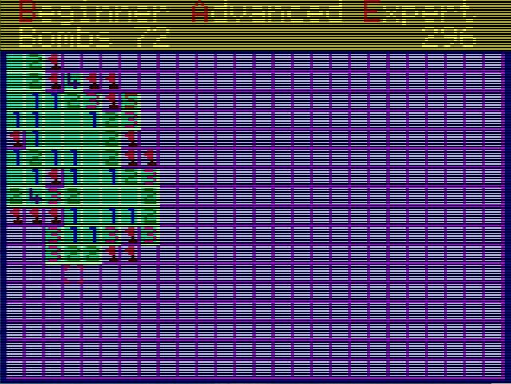

# Minesweeper for the GIGATRON

The game Minesweeper should be familiar to most.
The Gigatron is a 1980's style computer consisting of just a handful of 7400 series TTL chips.
Everything about the Gigatron can be found here:

https://gigatron.io/

https://forum.gigatron.io/

There are two compilers for the Gigatron. A BASIC and a C compiler. With the gtBASIC I had already made a game. It can be found here:

https://forum.gigatron.io/viewtopic.php?t=300&start=10

To play a bit with the glcc compiler I decided to use Minesweeper. You can find the glcc here:

https://github.com/lb3361/gigatron-lcc

## My Version



Game controls:

- Move cursor with the corresponding key on the keyboard or controller
- Mark field with SPACE or key B on the controller
- Uncover field with ENTER or key A on the controller
- Restart the game N key or Start key on the controller
- Change game strength
  - Beginner: key B
  - Advanced: key A
  - Expert: key E
- Key D reveals the playing field. It is not a game function, but is used for debugging.

## use SYS_Sprite6_v3

To use SYS_Sprite6_v3 it must be added glcc.To use SYS_Sprite6_v3, it must be added glcc. I have added the following code to these two files:

gigatron-lcc/gigatron/libc/gigatron.s

```
    # ----------------------------------------
    # void SYS_Sprite6_v3(char *addr, char *dest);
    def code0():
        nohop()
        label('SYS_Sprite6_v3')
        _LDI('SYS_Sprite6_v3_64');STW('sysFn')
        LDW(R8);STW('sysArgs0')
        LDW(R9);SYS(64);RET()

    module(name='sys_sprite6.s',
           code=[('EXPORT', 'SYS_Sprite6_v3'),
                 ('CODE', 'SYS_Sprite6_v3', code0) ])
```

gigatron-lcc/include/gigatron/gigatron/sys.h

```
void SYS_Sprite6_v3(char *source, char *destination);
#define has_SYS_Sprite6_v3() 1
```

After that, the glcc must be rebuilt once again.

```
/gigatron-lcc$ suso make clean
/gigatron-lcc$ suso make install
```

